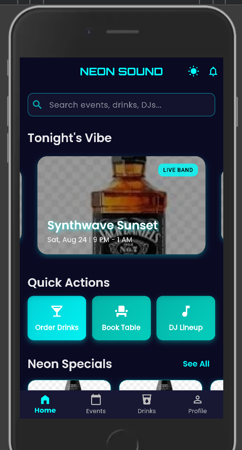
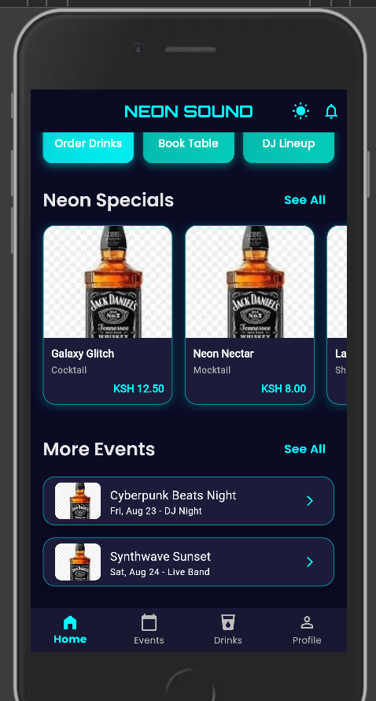
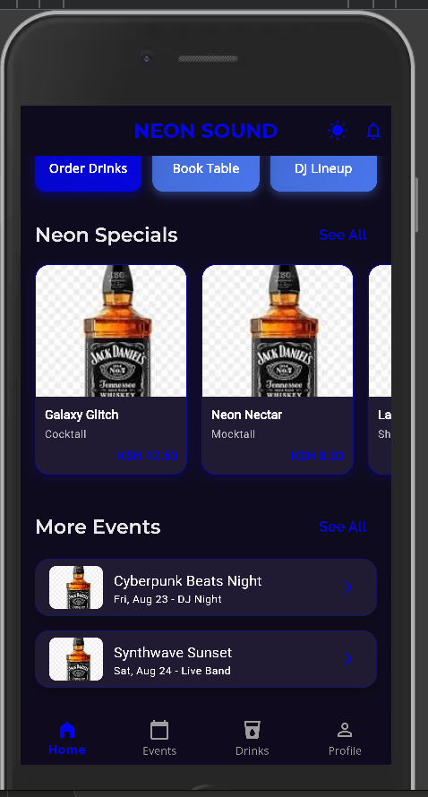
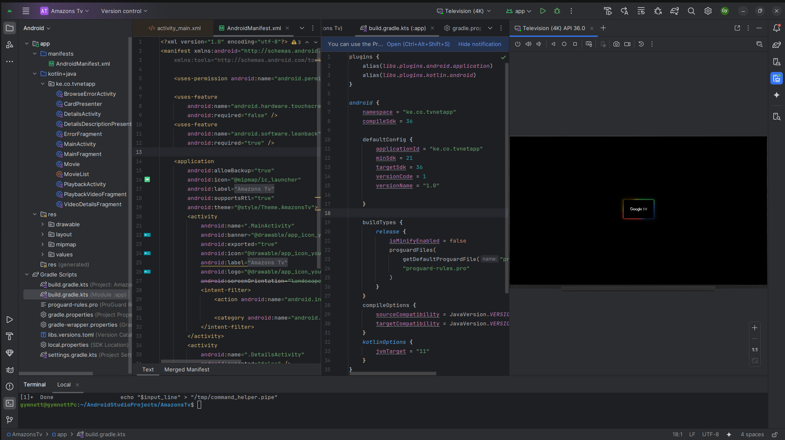
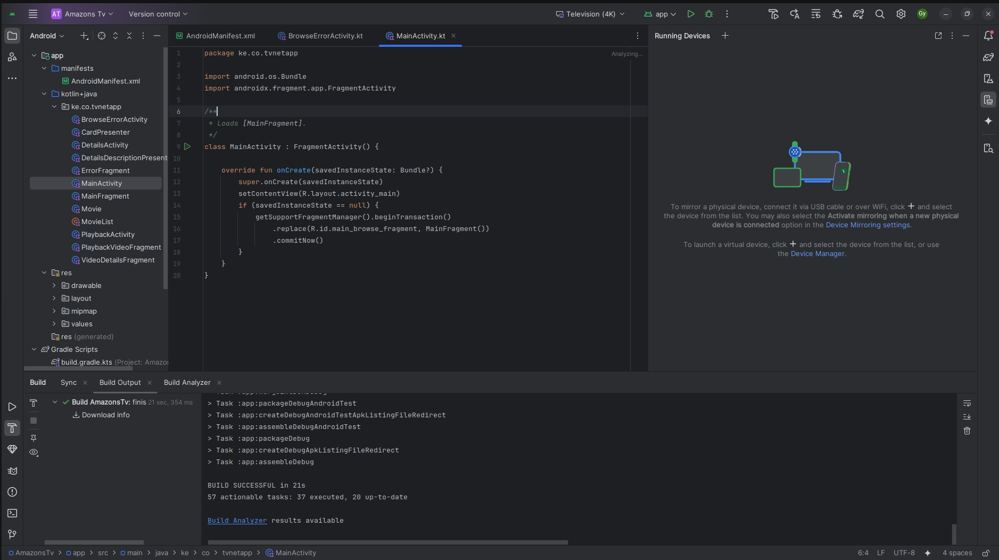
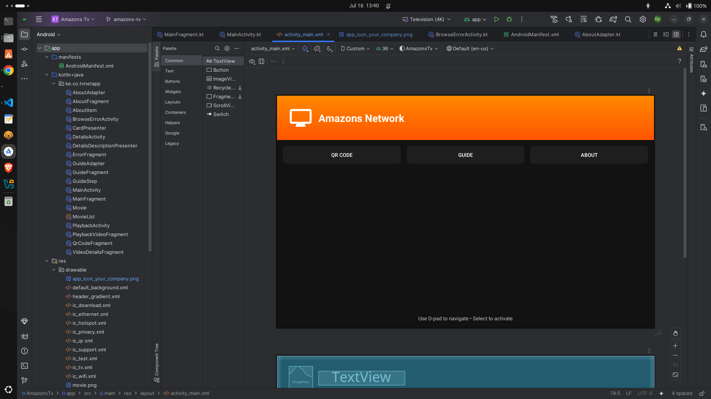
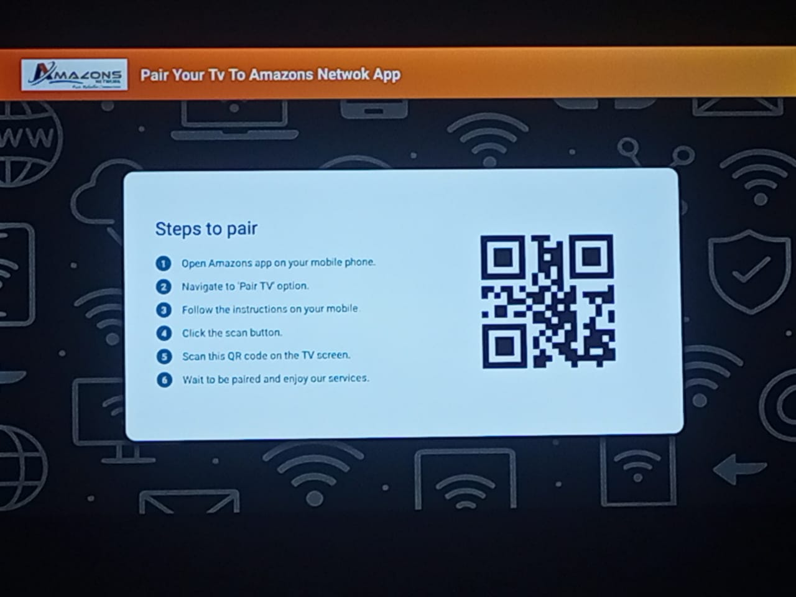
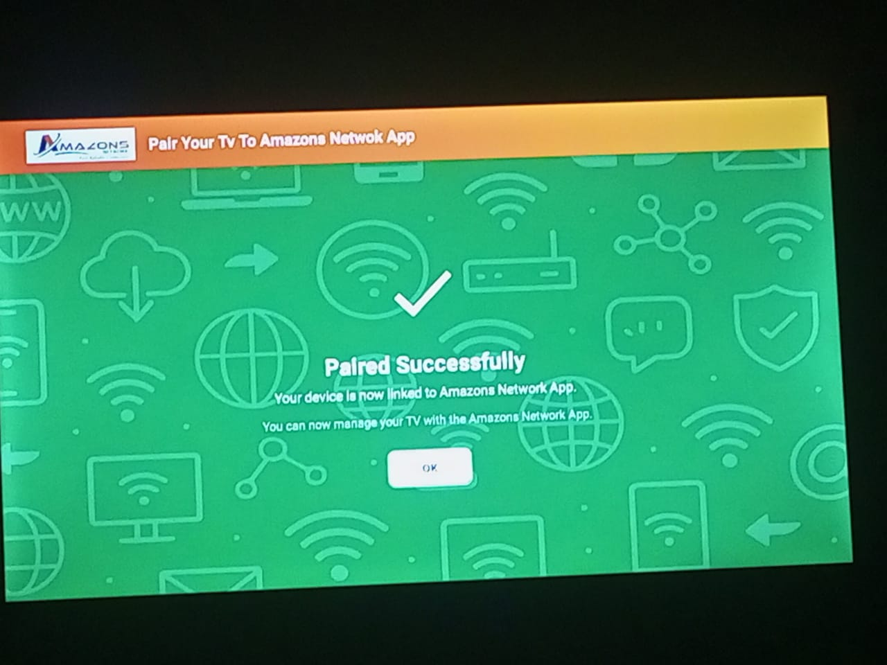


---

# WABWIRE LINUS

A curated collection of my work with visual previews. Click on any image to explore the project in detail.

## 🌐 Socials:
  

# 💻 Tech Stack:
               
# 📊 GitHub Stats:
 
 

### ✍️ Random Dev Quote

---

<!-- Proudly created with GPRM ( https://gprm.itsvg.in ) -->

## Skills Demonstrated

- **AI & Machine Learning**: Hugging Face API, TensorFlow, PyTorch, NLP techniques, model deployment.
- **Full-Stack Development**: JavaScript (ES6+), Node.js, React, Next.js, Python, Django.
- **Cross Platform Apps**: Browser, Android, Apple, Tv Apps, Desktop Apps, Smart Watch Apps...
- **Database & API Management**: PostgreSQL, REST APIs, AWS GraphQL.
- **Testing & DevOps**: Mocha, CI/CD, AWS, Docker, Git, GitHub, Firebase Tools.
- **Systems Development**: C++ programming.
- **Agile Methodologies**: Problem-solving, collaborative teamwork.
- 

## Contact

- GitHub: [@Gymnott1](https://github.com/Gymnott1)
- LinkedIn: [Linus Wabwire](https://www.linkedin.com/in/linus-wabwire-4164a1293)
- Email: linusokello8@gmail.com / gymnottwc@gmail.com

Feel free to reach out if you have any questions or would like to collaborate!

---

## Contributions

- [Western Region Research and Innovation Consortium (WRRIC) Workshop at Kisii University.](https://www.maseno.ac.ke/western-region-research-and-innovation-consortium-wrric-workshop-kisii-university)

- [Maseno University Computing and Informatics Students Association (MUCISA) Hackathon 2025: Smart Campus Solutions at Maseno University](https://www.maseno.ac.ke/maseno-university-computing-and-informatics-students-association-mucisa-hackathon-2025-smart-campus)

- [Enactus Maseno Chapter](https://enactusmasenochapter.africa/)

- [Smart Farming LLC](https://smartfarm.enactusmasenochapter.africa/)

- [Vibex-CLI command line tool to help prepare your code and documents for vibe coding](https://www.npmjs.com/package/vibex-cli)

- [House Hub Real Estate Web App](https://househub.co.ke/)

- [House Hub Real Estate Web App](https://comradehostels.co.ke/)

- [https://comradehostels.co.ke/new_homepage/](https://comradehostels.co.ke/new_homepage/)

- 

## Projects

### 1. **Learn to Backend**

A full-stack AI web app built using ReactJS, Django, PostgreSQL, and Hugging Face API.

---

### 2. **AIRES System**

A comprehensive AI-driven system utilizing ReactJS, Django, PostgreSQL, and Hugging Face API.

---

### 3. **Cloud Engineering and DevOps Roadmap**

A detailed roadmap for Cloud Engineering and DevOps practices.

---

### 4. **Eshop Mobile App**

A mobile e-commerce application for online shopping.

---

### 5. **Call App Mobile**

A mobile app for transcribing calls using AI.

---

### 6. **Shoe Shop**

An online store for purchasing shoes.

---

### 7. **Static Website Deployment with AWS Cloud Services**

A project demonstrating static website deployment using AWS Cloud Services.

---

### 8. **Police Crime Management System**

A system for managing police crime records and operations.

---

### 9. **Farming Assistance Chat UI**

An AI-powered chat interface for farming assistance.

---

### 10. **Deepfake Detection System**

A system for detecting deepfake images using deep learning models.

---

### 11. **Text-to-Audio Transcriber Extension**

A browser extension for transcribing text to audio.

---

### 12. **VibEx CLI**

A CLI tool for streamlining AI coding assistant workflows.

---

### 13. **AIRES-SYS-BACKEND**

The backend system for the AIRES project.

---

### 14. **CRYPTO-DOT**

Concept to solve the problem of deepfake and image manipulation.

---
### 15. **FLUTTER MOBILE APPS**

### 16. **Tv Apps Development In react native, java, kotlin**

---

Feel free to reach out if you have any questions or would like to collaborate!

---

